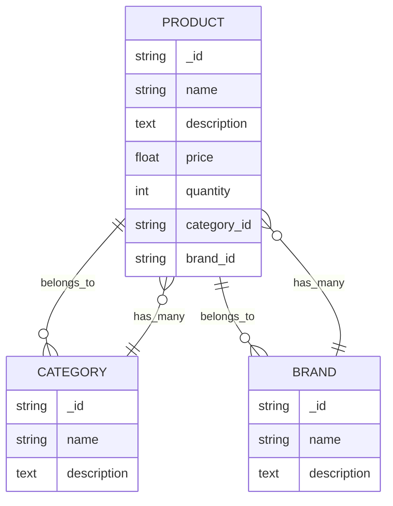
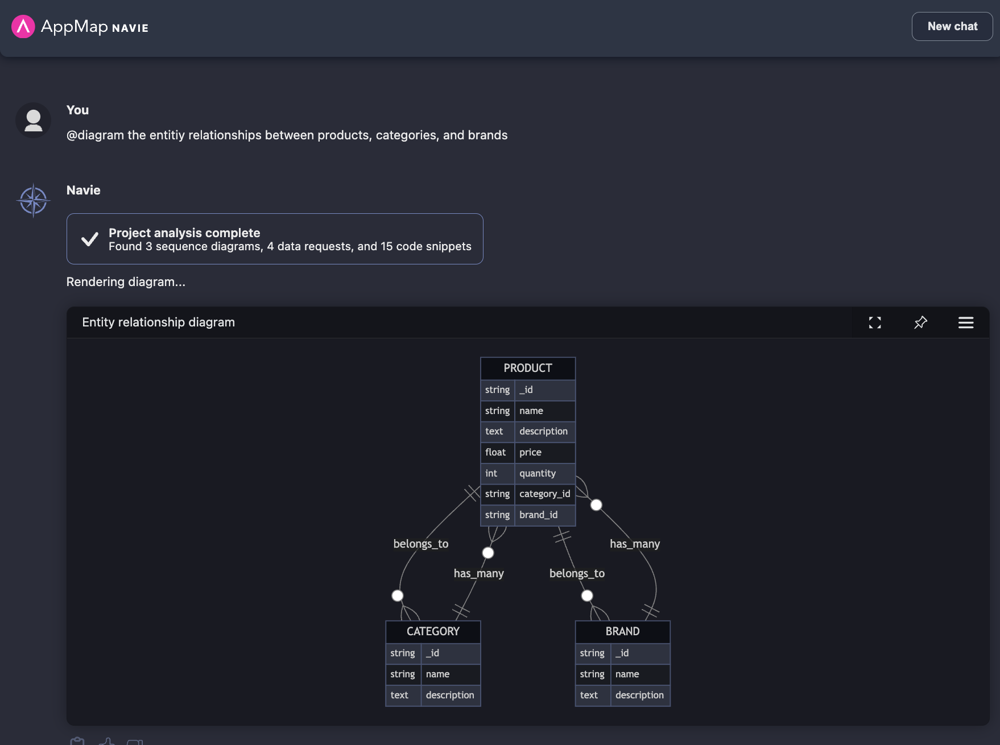
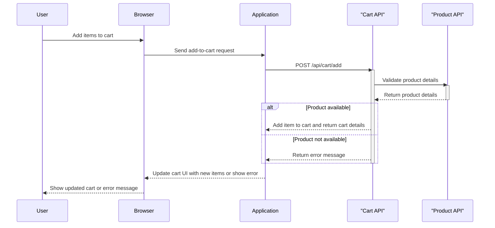
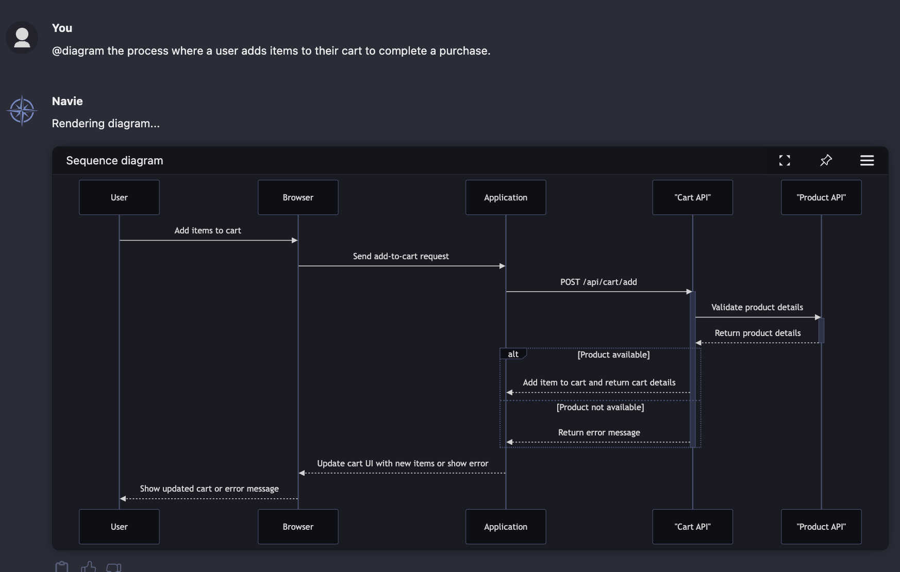
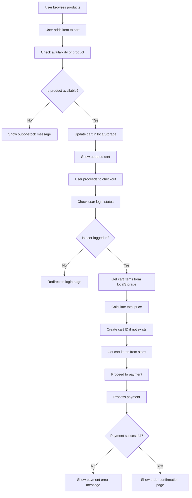
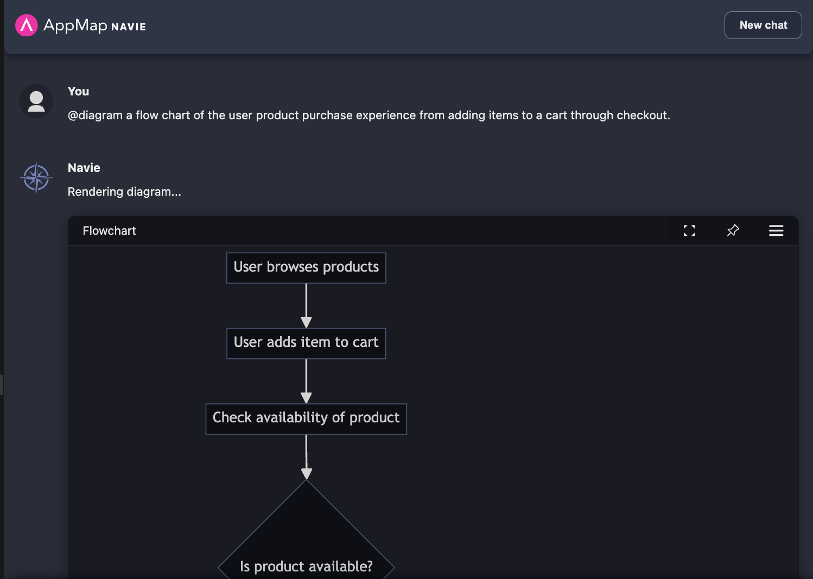
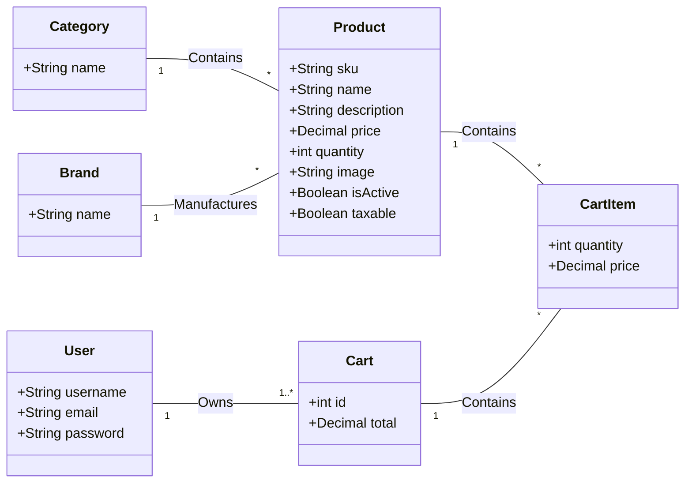
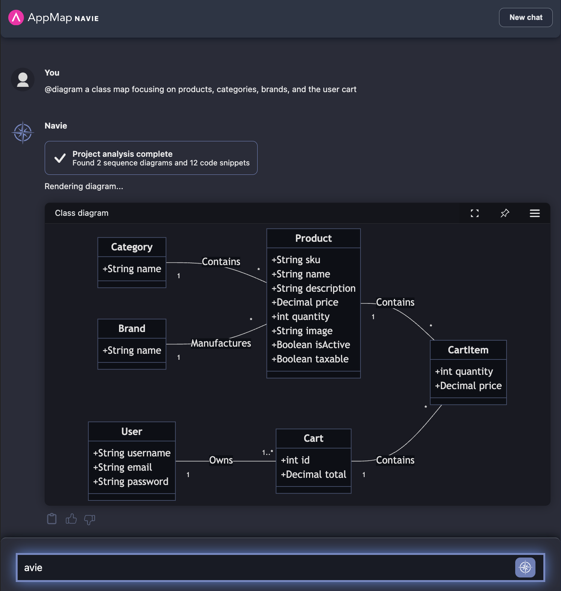

This project is a fork of the [MERN Ecommerce](https://github.com/mohamedsamara/mern-ecommerce) project. You can view the original [README here](OLD_README.md). 
This an ideal MERN (Mongo, Express, React, Node) project to use with the [AppMap Navie](https://appmap.io/navie/) AI Architect.

You can use this project to ask various questions of AppMap Navie using the `@diagram` command prefix.  
This will generate Mermaid diagrams that you can use within GitHub Issues & Pull Requests, or otherwise share 
with members of your team. 

## Example Diagrams
  - [Entity Relationship](#entity-relationship)
  - [Sequence Diagram](#sequence-diagram)
  - [Flow Chart](#flow-chart)
  - [Class Map](#class-map)

### Entity Relationship

```
@diagram the entitiy relationships between products, categories, and brands
```





### Sequence Diagram
```
@diagram the process where a user adds items to their cart to complete a purchase.
```






### Flow Chart

```
@diagram a flow chart of the user product purchase experience from adding items to a cart through checkout.
```





### Class Map

```
@diagram a class map focusing on products, categories, brands, and the user cart
```



